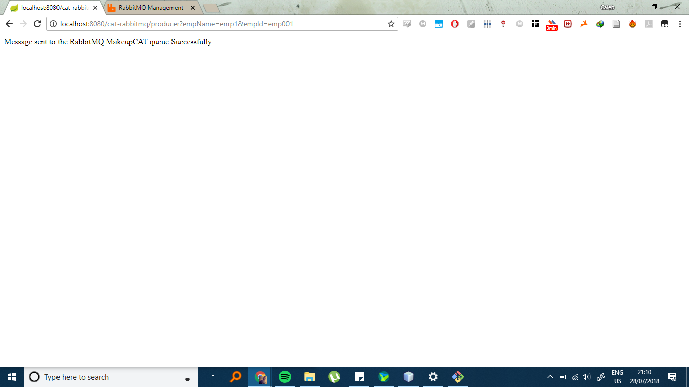

# SPRING WITH REST
This program Integrates SpringBoot and RabbitMQ

The RabbitMQSender class in the controller sends a message to the RabbitMQ which is then pushed to a queue

After starting the Java application and with RabbitMQ running enter
http://localhost:8080/cat-rabbitmq/producer?empName=emp1&empId=emp001
This will trigger the passing of a message with those values to the queue.

to view the message in queue go to http://localhost:15672/

It should show a message in queue, in this case "cat.queue".
